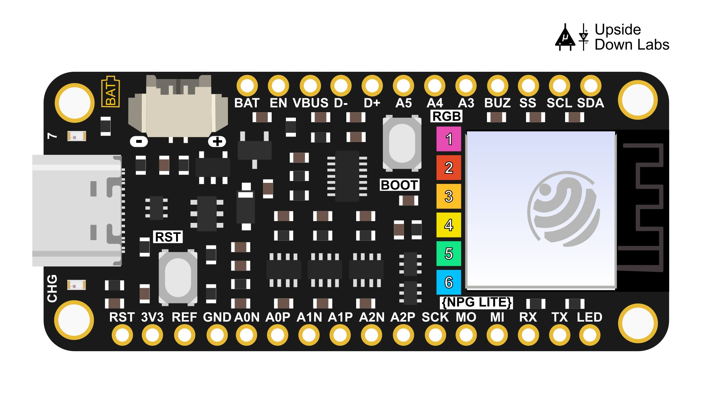
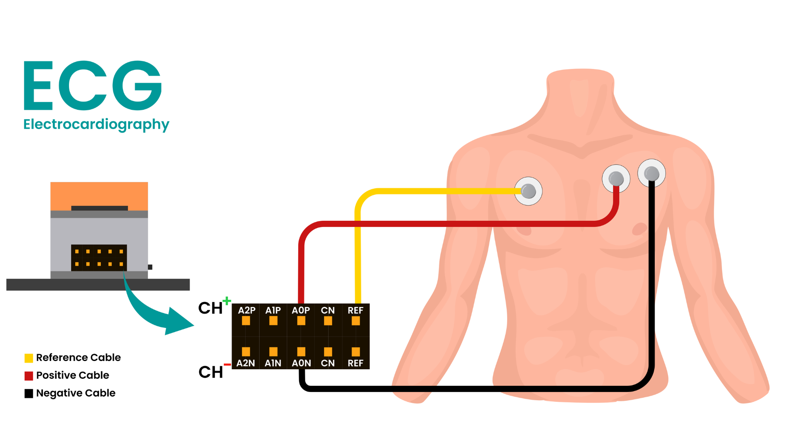
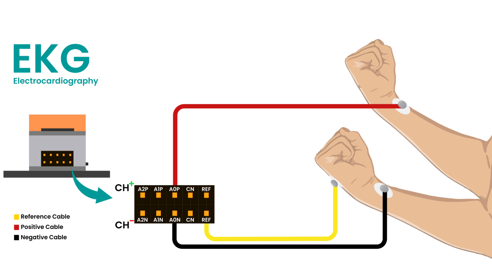

# NPG-Lite Cardio

A web-based ECG monitor for Neuro Playground Lite. Works on Windows, Mac, Linux and Android.

## Requirements

- Any Chromium-based browser: Chrome, Brave, Edge, etc. (Firefox does not support Web Bluetooth)
- An NPG-Lite device (Explorer, Ninja or Beast pack)
- NPG-Lite-BLE firmware flashed on the device. You can flash it using [NPG-Lite-Flasher-Web](https://upsidedownlabs.github.io/NPG-Lite-Flasher-Web/)

## How to use

1. Turn on NPG Lite by flipping the switch on it. Make sure it is not connected to a charger.
2. Make sure the device is charged. The 6th neopixel shows battery level: green above 70%, orange between 20–70%, red below 20%.
3. Make sure Bluetooth is enabled on your device. Do not pair or connect to NPG Lite from your system Bluetooth settings, only connect through the browser.
4. Open the ECG monitor in any Chromium-based browser (Chrome, Brave, Edge, etc.), then click the connect button (Bluetooth icon).
5. Select your NPG device from the browser popup.
6. ECG starts streaming automatically.
7. Sit at least 1 m away from any AC appliance (fans, chargers, monitors, etc.) to avoid interference.

To stop, click the disconnect button on the top right. If the device goes out of range, it disconnects on its own.

For a more detailed guide, follow the tutorial on [Instructables](https://www.instructables.com/Monitor-ECG-and-Heartrate-on-Your-Mobile-Phone/).

## Board reference

## Electrode placement

**ECG**

**EKG**

## Features

- Real-time ECG display at 500 Hz using WebGL
- BPM readout with beat detection (Pan-Tompkins)
- Signal quality detection — ignores noise and floating leads
- DC filter toggle to remove baseline wander
- R-peak markers on the waveform, toggle the button to enable/disable
- Record ECG sessions and save them to browser storage
- Play back, rename, download (CSV), or delete recordings
- Minimap scrubber for navigating long recordings
- Light and dark theme
- Fullscreen mode
- Works with both 3CH and 6CH NPG-Lite firmware variants

## Notes

- Recordings are stored in IndexedDB in the browser. Clearing site data will delete them, so download anything you want to keep.
- Minimum recording length is 12 seconds and shorter ones are discarded automatically.
